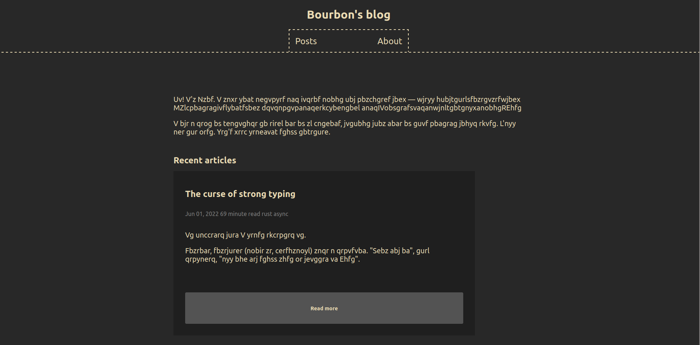

# Inkspace
This is a framework for blogs, built in Rust. 

## Roadmap
- [x] Build a HTML template to visualize our design.
- [ ] Write HTML generator.
- [ ] Write a Markdown parser and generate HTML using it.
- [ ] Tend to other features.

## Current design

## Running the blog
Currently in test mode. Use `cargo run` and it should start a server at 
some port.
